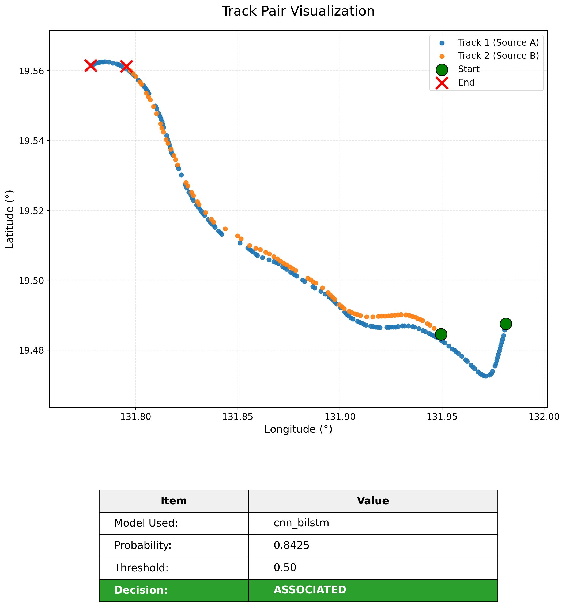
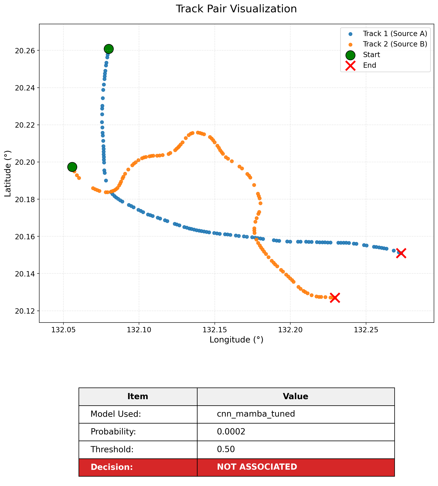
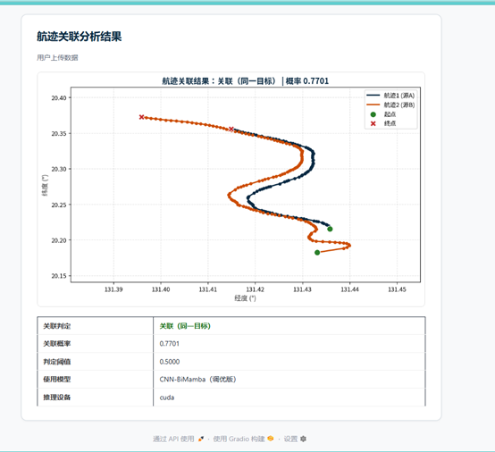

# 双源 AIS 航迹关联（Track Association）

基于深度学习的**双源船舶航迹关联**：对两条来自不同观测源（雷达 A / 雷达 B）的轨迹序列进行二分类，判断是否为**同一 MMSI**。仓库内含 CNN、LSTM/BiLSTM/BiGRU、CNN+LSTM、**CNN+Mamba（BiMamba）** 等对比模型，以及 KNN、灰色关联等传统基线。

---

## 环境

- Python 3.10+（推荐）
- **PyTorch**：请按官方说明先安装与你 CUDA 版本一致的 `torch`，再安装其余依赖。

```bash
pip install -r requirements.txt
```

仅使用不含 Mamba 的模型时，可暂时不安装 `mamba-ssm`；训练 `--model cnn_mamba` 或运行 `ablation_cnn_mamba.py` 时需要。

---

## 数据目录说明

| 路径 | 说明 |
|------|------|
| `data/raw/真实场景/` | **原始场景轨迹** CSV：`场景-{id}.csv`（默认处理 `0 … 4999`）。 |
| `data/final_dataset/` | **生成后的训练数据**：`track1_*.npy`、`track2_*.npy`、`labels_*.npy`、`lengths_*.npy`，以及 `scaler_*.npy`、`test_set_csvs/`。 |
| `output/` | 模型权重、曲线、评测图表等。 |

---

## 数据集来源与生成方式

### 1. 原始数据（来源）
- 原始数据集来源于公开数据集MTAD，链接https://www.scidb.cn/detail?dataSetId=c7d8dc56fe854ec2b084d075feb887fd
- 原始文件为按**场景**切片的船舶轨迹 CSV，下载后，放置于 `data/raw/真实场景/`目录下，然后运行脚本simulation_track6.py实现仿真。
- 单文件命名：`场景-{scene_id}.csv`（如 `场景-0.csv`）。
- 单列字段示例：`MMSI`, `time`, `lat`, `lon`, `vel`, `cou`（纬度、经度、航速、航向等典型 AIS/轨迹字段）。
- 每条轨迹在场景内按 `MMSI` 分组；同一 MMSI 对应一条**真值航迹**，作为后续「双源观测」仿真的基础。

> **说明**：若论文或合规需要写明「数据来自某公开库/内河仿真平台/自采 AIS」，请在本小节替换为你的实际来源；本仓库仅保证与上述 CSV 格式及脚本一致。

### 2. 合成双源数据（生成流程）

完整流水线由 `code/data_process/simulation_track6.py` 实现，核心步骤如下。

1. **双观测源仿真（source 9001 / 9002）**  
   对每条真值航迹分别模拟两个接收端，注入**系统偏差**（经纬偏移）、**高斯/相关噪声**（位置、航速、航向）、**随机丢点**、**时间轴重采样**（不同 `freq_ratio`）及随机**首尾截断**，得到两条不同形态的观测序列，并打上 `source` 标记。

2. **正样本**  
   同一 MMSI：真值航迹分别经 9001、9002 仿真，构成标签为 **1** 的航迹对。

3. **负样本（困难负样本）**  
   选自**不同 MMSI** 的两条真值航迹，要求平均航速差、平均航向差落在一定阈值内（运动学相似）；再分别仿真到两源，并将其中一条做**空间平移**使两条轨迹空间上可对齐比对，标签为 **0**。避免「仅靠速度/航向差即可分开」的过于简单的负样本。

4. **特征与长度**  
   每条序列取 `lat, lon, vel, cou` 四维；截断/零填充至固定最大长度（脚本内 `MAX_SEQ_LEN`），并单独记录**有效长度**（非 padding 段长度），避免将 padding 参与归一化。

5. **标准化**  
   在**所有真实点（不含 padding）**上拟合 `StandardScaler`，再逐样本仅对有效段变换；`scaler_mean.npy`、`scaler_scale.npy` 写入 `data/final_dataset/`。

6. **划分**  
   按标签**分层随机**划分：**训练 / 验证 / 测试 ≈ 70% / 15% / 15%**（脚本：`train_test_split` 先 70/30，再对 30% 做 1/3 与 2/3 的二次划分）。

7. **导出**  
   - NumPy：`track1_{train,val,test}.npy` 等，以及按测试集序列长度分桶的 `test_short` / `test_medium` / `test_long`（若脚本启用）。  
   - 测试集可选导出为逐样本 CSV：`data/final_dataset/test_set_csvs/`（便于推理与可视化）。

### 3. 如何重新生成 `final_dataset`

在项目根目录执行（路径在脚本首部常量中配置；若你的工程不在本机原路径，请先修改 `REAL_SCENE_ROOT` / `OUTPUT_ROOT`）：

```bash
cd /path/to/track_association
python code/data_process/simulation_track6.py
```

历史流水线中还存在 `train_data_process.py`、`csv2npy.py` 等脚本，当前与 `train.py`、`ablation_cnn_mamba.py` **对齐的主数据形态**以 `simulation_track6.py` 输出为准。

---

## 训练（示例）

在 `code/` 下运行（数据路径以 `train.py` 内 `PROJECT_ROOT` 为相对根目录）：

```bash
cd code
python train.py --model cnn_mamba --epochs 30 --batch_size 64
```

可选 `--model`：`cnn_mamba`, `cnn_lstm`, `cnn_bilstm`, `bilstm`, `cnn`, `lstm`, `bigru`, `ann`。

Mamba 相关消融：

```bash
python ablation_cnn_mamba.py --mode train --config cnn1 --gpu 0
```

---

## 评测与说明

- 全模型测试集评测：`code/eval_all_on_test.py`  
- 传统方法：`code/traditional_knn.py`, `code/traditional_gra.py`, `code/eval_traditional_on_test.py`

---

## 航迹关联推理执行
- 航迹关联推理（英文结果）：`track_association_inference.py`
- 中文推理：`track_association_inference_thesis.py`
- 命令：`python track_association_inference_thesis.py --label 1 --length short --sample 3819 --model cnn_mamba_tuned`选取推理的模型和数据集，如果没有数据集，支持自定义两个航迹的csv文件，更改路径进行推理

<div align="center">
  
  <br>
  <b>图1 可关联航迹</b>
</div>

<div align="center">
  
  <br>
  <b>图2 不可关联航迹</b>
</div>
---

## 路径提示

仓库内**部分脚本仍硬编码** `DATA_DIR = '/home/yangcq/track_association/...'`。克隆到其他机器后，请批量替换为你的本地根路径，或改为基于 `__file__` 的 `PROJECT_ROOT`（与 `train.py` 一致），否则无法找到 `data/final_dataset`。

---

## 端到端多源航迹关联系统
本项目实现了端到端的网页推理效果 服务器进入`track_association_demo`文件夹，运行app3.py文件，本地进入网页http://localhost:7860/?

 <div align="center">
  
  <br>
  <b>图1 航迹关联演示页面</b>
</div>

<div align="center">
  
  <br>
  <b>图2 航迹关联结果展示</b>
</div>

